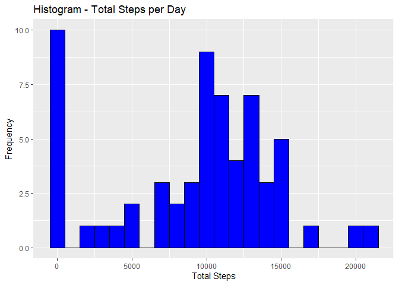
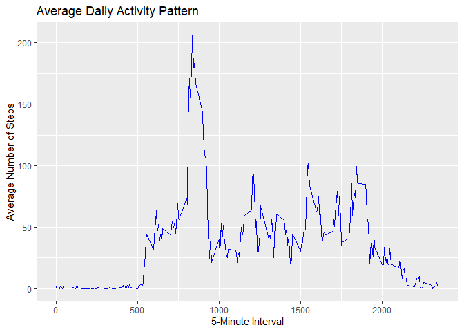
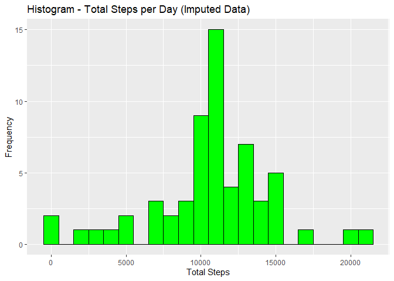
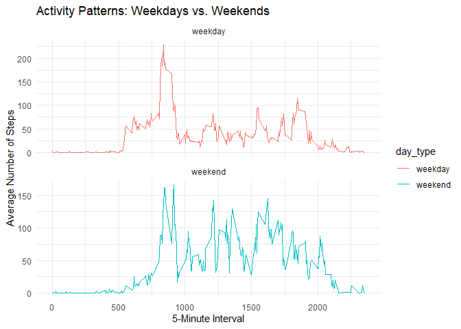

``` r
library(dplyr)
```

```
## Warning: package 'dplyr' was built under R version 4.4.2
```

```
## 
## Attaching package: 'dplyr'
```

```
## The following objects are masked from 'package:stats':
## 
##     filter, lag
```

```
## The following objects are masked from 'package:base':
## 
##     intersect, setdiff, setequal, union
```

``` r
library(ggplot2)
```

## Loading and preprocessing the data
1. Load the data from the working directory - Link Source:
https://d396qusza40orc.cloudfront.net/repdata%2Fdata%2Factivity.zip) 


``` r
df_activity <- read.csv("activity.csv", header=T, sep=",")
```

2. Process/transform the data (if necessary) & basic checks

``` r
head(df_activity)
```

```
##   steps       date interval
## 1    NA 2012-10-01        0
## 2    NA 2012-10-01        5
## 3    NA 2012-10-01       10
## 4    NA 2012-10-01       15
## 5    NA 2012-10-01       20
## 6    NA 2012-10-01       25
```


``` r
str(df_activity)
```

```
## 'data.frame':	17568 obs. of  3 variables:
##  $ steps   : int  NA NA NA NA NA NA NA NA NA NA ...
##  $ date    : chr  "2012-10-01" "2012-10-01" "2012-10-01" "2012-10-01" ...
##  $ interval: int  0 5 10 15 20 25 30 35 40 45 ...
```

``` r
# Switch format date character into date
df_activity$date <- as.Date(df_activity$date, format = "%Y-%m-%d")
# check format again
str(df_activity)
```

```
## 'data.frame':	17568 obs. of  3 variables:
##  $ steps   : int  NA NA NA NA NA NA NA NA NA NA ...
##  $ date    : Date, format: "2012-10-01" "2012-10-01" ...
##  $ interval: int  0 5 10 15 20 25 30 35 40 45 ...
```


``` r
summary(df_activity)
```

```
##      steps             date               interval     
##  Min.   :  0.00   Min.   :2012-10-01   Min.   :   0.0  
##  1st Qu.:  0.00   1st Qu.:2012-10-16   1st Qu.: 588.8  
##  Median :  0.00   Median :2012-10-31   Median :1177.5  
##  Mean   : 37.38   Mean   :2012-10-31   Mean   :1177.5  
##  3rd Qu.: 12.00   3rd Qu.:2012-11-15   3rd Qu.:1766.2  
##  Max.   :806.00   Max.   :2012-11-30   Max.   :2355.0  
##  NA's   :2304
```
## What is mean total number of steps taken per day?
Note: For this part of the assignment, the missing values in the dataset can be ignored

1. Calculate the total number of steps taken per day

``` r
# Sum up the steps by date
total_steps_per_day <- df_activity %>%
  group_by(date) %>%
  summarise(total_steps = sum(steps, na.rm = TRUE))

head(total_steps_per_day)  # Show the first results
```

```
## # A tibble: 6 × 2
##   date       total_steps
##   <date>           <int>
## 1 2012-10-01           0
## 2 2012-10-02         126
## 3 2012-10-03       11352
## 4 2012-10-04       12116
## 5 2012-10-05       13294
## 6 2012-10-06       15420
```
2. Histogram of the total number of steps taken each day


``` r
ggplot(total_steps_per_day, aes(x = total_steps)) +
  geom_histogram(binwidth = 1000, fill = "blue", color = "black") +
  labs(title = "Histogram - Total Steps per Day", 
       x = "Total Steps", y = "Frequency")
```

<!-- -->

3. Calculate and report the mean and median of the total number of steps taken per day


``` r
steps_vector <- total_steps_per_day$total_steps
steps_vector <- steps_vector[!is.na(steps_vector)]

mean_steps <- mean(steps_vector)
median_steps <- median(steps_vector)


mean_steps  
```

```
## [1] 9354.23
```

``` r
median_steps
```

```
## [1] 10395
```
## What is the average daily activity pattern?
1. Make a time series plot (i.e. type = "l") of the 5-minute interval (x-axis) and the average number
of steps taken, averaged across all days (y-axis)


``` r
average_steps_interval <- df_activity %>%
  group_by(interval) %>%
  summarise(mean_steps = mean(steps, na.rm = TRUE))

head(average_steps_interval)  # Show the first results
```

```
## # A tibble: 6 × 2
##   interval mean_steps
##      <int>      <dbl>
## 1        0     1.72  
## 2        5     0.340 
## 3       10     0.132 
## 4       15     0.151 
## 5       20     0.0755
## 6       25     2.09
```

``` r
ggplot(average_steps_interval, aes(x = interval, y = mean_steps)) +
  geom_line(color = "blue") +
  labs(title = "Average Daily Activity Pattern",
       x = "5-Minute Interval", y = "Average Number of Steps")
```

<!-- -->

2. Which 5-minute interval, on average across all the days in the dataset, contains the maximum number
of steps?


``` r
max_interval <- average_steps_interval %>%
  filter(mean_steps == max(mean_steps))

max_interval
```

```
## # A tibble: 1 × 2
##   interval mean_steps
##      <int>      <dbl>
## 1      835       206.
```

## Imputing missing values
Note that there are a number of days/intervals where there are missing values (coded as NA). The
presence of missing days may introduce bias into some calculations or summaries of the data

1. Calculate and report the total number of missing values in the dataset (i.e. the total number of rows with NAs)

``` r
total_missing_values <- sum(is.na(df_activity$steps))

total_missing_values
```

```
## [1] 2304
```
2. Devise a strategy for filling in all of the missing values in the dataset

``` r
# Calculate the mean number of steps for each 5-minute interval
interval_means <- df_activity %>%
  group_by(interval) %>%
  summarise(mean_steps = mean(steps, na.rm = TRUE))
```

3. Create a new dataset that is equal to the original dataset but with the missing data filled in

``` r
# Create a new dataset with missing values filled in
df_activity_imputed <- df_activity %>%
  left_join(interval_means, by = "interval") %>%
  mutate(steps = ifelse(is.na(steps), mean_steps, steps)) %>%
  select(-mean_steps)  # Remove the temporary 'mean_steps' column

# Check the first rows of the new dataset
head(df_activity_imputed)
```

```
##       steps       date interval
## 1 1.7169811 2012-10-01        0
## 2 0.3396226 2012-10-01        5
## 3 0.1320755 2012-10-01       10
## 4 0.1509434 2012-10-01       15
## 5 0.0754717 2012-10-01       20
## 6 2.0943396 2012-10-01       25
```

4. Make a histogram of the total number of steps taken each day and Calculate and report the mean
# and median total number of steps taken per day


``` r
# Calculate the total number of steps per day (with imputed data)
total_steps_per_day_imputed <- df_activity_imputed %>%
  group_by(date) %>%
  summarise(total_steps = sum(steps))

# Create a histogram of total steps per day (with imputed data)
ggplot(total_steps_per_day_imputed, aes(x = total_steps)) +
  geom_histogram(binwidth = 1000, fill = "green", color = "black") +
  labs(title = "Histogram - Total Steps per Day (Imputed Data)", 
       x = "Total Steps", y = "Frequency")
```

<!-- -->

``` r
# Extract the total steps vector
steps_vector_imputed <- total_steps_per_day_imputed$total_steps

# Calculate mean and median
mean_steps_imputed <- mean(steps_vector_imputed)
median_steps_imputed <- median(steps_vector_imputed)

# Display the results
mean_steps_imputed
```

```
## [1] 10766.19
```

``` r
median_steps_imputed
```

```
## [1] 10766.19
```

``` r
# Compare Original vs. Imputed Data
# To understand the impact of imputing missing data, we compare the mean and median from the
# original data with the imputed data:

# Calculate the differences in mean and median
mean_difference <- mean_steps_imputed - mean_steps
median_difference <- median_steps_imputed - median_steps

# Display the differences
mean_difference
```

```
## [1] 1411.959
```

``` r
median_difference
```

```
## [1] 371.1887
```

``` r
print("The mean and median total steps per day changed slightly after imputation")
```

```
## [1] "The mean and median total steps per day changed slightly after imputation"
```
## Are there differences in activity patterns between weekdays and weekends?
For this part the weekdays() function may be of some help here. Use the dataset with the filled-in
missing values for this part

1. Create a new factor variable in the dataset with two levels – “weekday” and “weekend” indicating whether a given date is a weekday or weekend day


``` r
# Add a 'day_type' column to indicate weekdays vs. weekends
df_activity_imputed <- df_activity_imputed %>%
  mutate(day_type = ifelse(weekdays(date) %in% c("Saturday", "Sunday"), 
                           "weekend", "weekday"))

# Check the counts of weekdays and weekends
table(df_activity_imputed$day_type)
```

```
## 
## weekday weekend 
##   12960    4608
```
2. Visualize Activity Patterns by Day Type
Make a panel plot containing a time series plot (i.e. type = "l"of the 5-minute interval (x-axis)
and the average number of steps taken, averaged across all weekday days or weekend days (y-axis). See
the README file in the GitHub repository to see an example of what this plot should look like using
simulated data.

``` r
# Calculate the average number of steps by interval and day type
average_steps_day_type <- df_activity_imputed %>%
  group_by(interval, day_type) %>%
  summarise(mean_steps = mean(steps))
```

```
## `summarise()` has grouped output by 'interval'. You can override using the
## `.groups` argument.
```

``` r
# Create a panel plot to compare activity patterns
ggplot(average_steps_day_type, aes(x = interval, y = mean_steps, color = day_type)) +
  geom_line() +
  facet_wrap(~ day_type, ncol = 1, scales = "free_y") +
  labs(title = "Activity Patterns: Weekdays vs. Weekends",
       x = "5-Minute Interval", y = "Average Number of Steps") +
  theme_minimal()
```

<!-- -->


